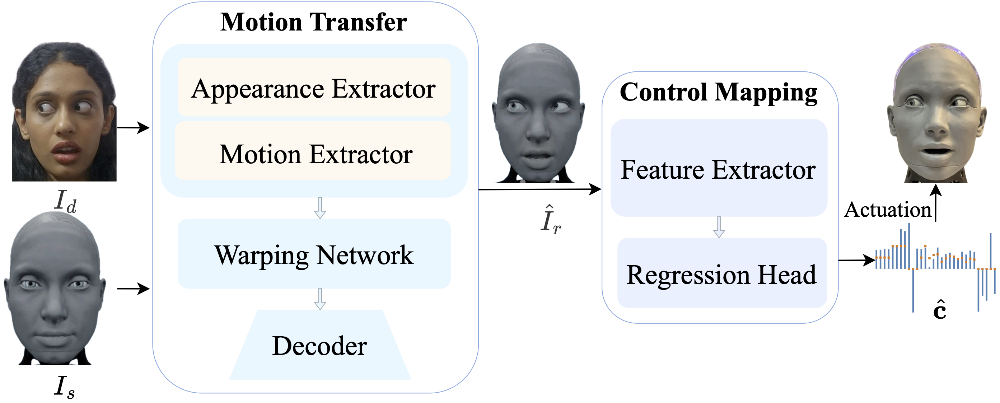
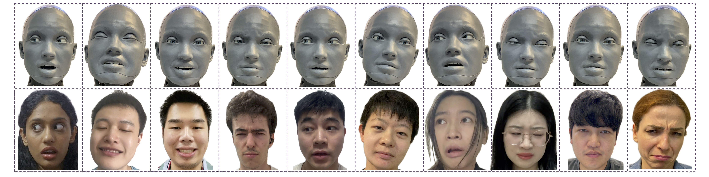

<div align="center">

<h1>X2C: A Large-Scale Benchmark for Nuanced Humanoid Facial Expression Imitation 🤖</h1>

<div>
    <a href="#" target="_blank">Peizhen Li</a><sup>1</sup>&emsp;
    <a href="#" target="_blank">Longbing Cao</a><sup>1</sup>&emsp;
    <a href="#" target="_blank">Xiao-Ming Wu</a><sup>2</sup>&emsp;
    <a href="#" target="_blank">Runze Yang</a><sup>1</sup>&emsp;
    <a href="#" target="_blank">Xiaohan Yu</a><sup>1</sup>
</div>
<br>
<div>
    <sup>1</sup>Macquarie University&emsp;
    <sup>2</sup>Nanyang Technological University
</div>
<br>
<div>
    <strong>Accepted by Pattern Recognition</strong>
</div>
<br>

[](https://arxiv.org/abs/2505.11146)
[]()
[](https://www.python.org/)
[](https://pytorch.org/)

<br>

**X2C is a large-scale benchmark and high-fidelity dataset for nuanced humanoid facial expression imitation, accompanied by X2CNet, a baseline methodology providing scalable inference pipelines and reference mapping networks for diverse robotic platforms.**

</div>

---



## 📰 News
1. Inference pipeline released
2. Demonstrations featuring multiple humanoid robots

## 🚀 Getting Started 
🔧 **Clone the Code and Set Up the Environment**

```bash
git clone git@github.com:lipzh5/X2CNet.git
cd X2CNet

# create env using conda
conda create -n x2cnet python=3.9
conda activate x2cnet
# for cuda 12.1
conda install pytorch==2.4.0 torchvision==0.19.0 torchaudio==2.4.0 pytorch-cuda=12.1 -c pytorch -c nvidia
```

 📦 **Install Python Dependencies**

```setup
pip install -r requirements.txt
```


## 🛠️ Dataset Preprocessing

A dataset preprocessing script has been uploaded to help correct image paths after downloading the X2C dataset.
You can find it here: [`misc/dataset_preprocessing.py`](misc/dataset_preprocessing.py)

**How to Use**
```
git clone https://huggingface.co/datasets/Peizhen/X2C
python misc/dataset_preprocessing.py  --x2c /path/to/X2C 
```

 **Make sure to replace** /path/to/X2C with the actual path where your X2C dataset is stored.

⚙️ **Configuration Reminder**

Update the **ictrl_data_path** field in your config.yaml to point to your local copy of the X2C dataset.

## Mapping Network Training
```train
python main.py train.batch_size=128 train.num_workers=16 train.num_epochs=100 train.lr=1e-3
```

## Mapping Network Evaluation
```eval
python main.py do_eval=True train.batch_size=128 train.num_workers=16 train.save_model_path=path/to/save_folder
```

## 📥 Pre-trained Models
You can download pre-trained models here:

 [🔗Mapping Network](https://drive.google.com/file/d/1GAiBihDk-vcc-wK-GY5o-kwWobUA4g53/view?usp=sharing) trained on <strong>X2C</strong> with a batch size of 128, learning rate of 1e-3, for 100 epochs, using ResNet18 as the feature extractor.

## 🚀 X2CNet Inference Pipeline

Download the required checkpoints for the **motion transfer module** from [LivePortrait](https://github.com/KwaiVGI/LivePortrait).

Update the paths in [`liveportrait_configs/inference_config.py`](liveportrait_configs/inference_config.py) accordingly.

To generate control values for on-robot execution, run:

```bash
python x2cnet_inference.py --driving /path/to/driving_video
```


## Real-world Inference Results

Our dataset and imitation pipeline are applicable to multiple robots with different facial appearances, requiring only minimal effort to project the control values onto the target platform.


## 🤝 Contributing
We are actively updating and improving this repository. If you find any bugs or have suggestions, welcome to raise issues or submit pull requests (PR) 💖.


## 💖 Citation 
If you find <strong>X2C</strong> or <strong>X2CNet</strong> useful for your research, welcome to 🌟 this repo and cite our work using the following BibTeX:
```bibtex
@article{li2025x2c, title={X2C: A Large-Scale Benchmark for Nuanced Humanoid Facial Expression Imitation}, 
author={Li, Peizhen and Cao, Longbing and Wu, Xiao-Ming and Yang, Runze and Yu, Xiaohan}, journal={arXiv preprint arXiv:2505.11146}, 
year={2025} }
```

*Long live in arXiv.*

