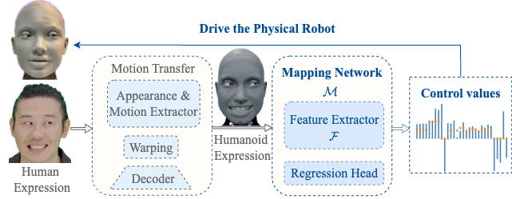

# X2CNet 🤖 
This repository is the official implementation of the imitation framework **X2CNet** in paper 

_**X2C: A Dataset Featuring Nuanced Facial Expressions 
for Realistic Humanoid Imitation**_ 




## 🚀 Getting Started 
🔧 **Clone the Code and Set Up the Environment**

```bash
git clone git@github.com:lipzh5/X2CNet.git
cd X2CNet

# create env using conda
conda create -n x2cnet python=3.9
conda activate x2cnet
# for cuda 12.1
conda install pytorch==2.4.0 torchvision==0.19.0 torchaudio==2.4.0 pytorch-cuda=12.1 -c pytorch -c nvidia
```

 📦 **Install Python Dependencies**

```setup
pip install -r requirements.txt
```


## 🛠️ Dataset Preprocessing

A dataset preprocessing script has been uploaded to help correct image paths after downloading the X2C dataset.
You can find it here: [`misc/dataset_preprocessing.py`](misc/dataset_preprocessing.py)

**How to Use**
```
git clone https://huggingface.co/datasets/Peizhen/X2C
python misc/dataset_preprocessing.py  --x2c /path/to/X2C 
```

 **Make sure to replace** /path/to/X2C with the actual path where your X2C dataset is stored.

⚙️ **Configuration Reminder**

Update the **ictrl_data_path** field in your config.yaml to point to your local copy of the X2C dataset.

## Training
```train
python main.py train.batch_size=128 train.num_workers=16 train.num_epochs=100 train.lr=1e-3
```

## Evaluation
```eval
python main.py do_eval=True train.batch_size=128 train.num_workers=16 train.save_model_path=path/to/save_folder
```

## 📥 Pre-trained Models
You can download pre-trained models here:

 [🔗Mapping Network](https://drive.google.com/file/d/1GAiBihDk-vcc-wK-GY5o-kwWobUA4g53/view?usp=sharing) trained on <strong>X2C</strong> with a batch size of 128, learning rate of 1e-3, for 100 epochs, using ResNet18 as the feature extractor.

## Real-world Inference Results


## 🤝 Contributing
We are actively updating and improving this repository. If you find any bugs or have suggestions, welcome to raise issues or submit pull requests (PR) 💖.


## 💖 Citation 
If you find <strong>X2C</strong> or <strong>X2CNet</strong> useful for your research, welcome to 🌟 this repo and cite our work using the following BibTeX:
```bibtex
@article{li2025x2c, title={X2C: A Dataset Featuring Nuanced Facial Expressions for Realistic Humanoid Imitation}, 
author={Li, Peizhen and Cao, Longbing and Wu, Xiao-Ming and Yang, Runze and Yu, Xiaohan}, journal={arXiv preprint arXiv:2505.11146}, 
year={2025} }
```

*Long live in arXiv.*

